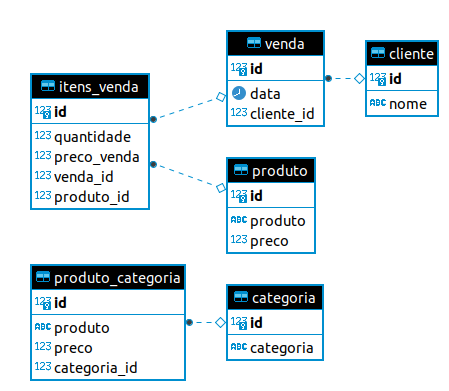

Projeto para treinamento em banco de dados PostgreSQL.

### Desafio 1 - importar dados de planilha Excel

Dada uma planilha em Excel, inserir os dados da planilha num banco de dados PostgreSQL.

**Dica:** você pode usar Python junto com [psycopg2](https://www.psycopg.org/docs/install.html) para se conectar no PostgreSQL.

Passos:

1. Criar uma virtualenv
2. Instalar psycopg2
3. Ler os dados da planilha Excel
4. Tratar os dados, se necessário
5. Inserir os dados no banco PostgreSQL
6. Coloque seu projeto no Gitlab, ou Github pessoal e me manda o link do repositório


### Desafio 2 - importar dados de planilhas relacionadas

Dada uma planilha com dados de Produtos e outra de Categorias, inserir os dados num banco de dados PostgreSQL, relacionando cada produto com sua categoria.

Os passos são idênticos aos anteriores.

Coloque tudo no mesmo repositório.


### Desafio 3 - importar todas as tabelas relacionadas

Rodando o script...

```
python gen_data.py
```

... teremos 5 tabelas, conforme a ilustração a seguir:



Note que o **preço de venda** está desatualizado, pois ele precisa ser calculado em **dólar**, e o dólar está R$ 5,60.

1. Insira todos os dados de todas as tabelas.
2. Atualize o **preço de venda** de cada produto, considerando o dólar a R$ 5,60.

**Nota:** os registros não podem duplicar.

**Dica:** considere o nome dos campos igual os campos das planilhas.

https://gist.github.com/rg3915/1d9e49e14d610dbd4cfc03422012e000


### Desafio 4 - repita o desafio 3 SEM Pandas.

**Dica:** monte uma lista com o script a seguir:

https://gist.github.com/rg3915/7210a14deae621822b0e3c302ba8c120


## Como rodar o projeto

```
git clone https://github.com/grazimelo/banco-psql.git
cd banco-psql
python -m venv .venv
```

Para ativar a virtualenv  digite:

```
source .venv/bin/activate
```

Para instalar as dependências:

```
pip install -r requirements.txt
```

## Criando banco de dados manualmente

### Opção 1

```
sudo su - postgres
psql
CREATE ROLE my_user ENCRYPTED PASSWORD 'suasenha' login;
CREATE DATABASE my_db OWNER my_usuario;
```

### Opção 2

```
sudo su - postgres
createdb my_db
createuser -P my_user
psql my_db
GRANT ALL PRIVILEGES ON DATABASE my_db TO my_usuario;
```


Crie um arquivo `.env` com sua senha:

```
PASSWORD=<sua_senha>
```

## Criando banco de dados com Python

Caso você queira deletar o usuário e o banco antes, digite

```
psql -U postgres -c "DROP USER my_usuario;"
psql -U postgres -c "DROP DATABASE my_db;"
```

Criando banco e tabelas

```
python create_database.py
python create_tables.py
```

## Inserindo os dados

```
python import_data.py
```


## Jupyter notebook

```
jupyter-notebook
```

## Links

http://pythonclub.com.br/tutorial-postgresql.html

https://github.com/juliano777/pgsql_fs2w/blob/master/postgresql_sql_basico.pdf

https://github.com/rg3915/fast-database

https://gist.github.com/rg3915/4ffb0bfdccf1a205ee1761185730411d

https://gist.github.com/rg3915/0f63ee9bde818c4a56abb110c94b855b

https://gist.github.com/rg3915/1d9e49e14d610dbd4cfc03422012e000

https://gist.github.com/rg3915/5fb3a2e7338115bc92e82b7a9a2b372b
